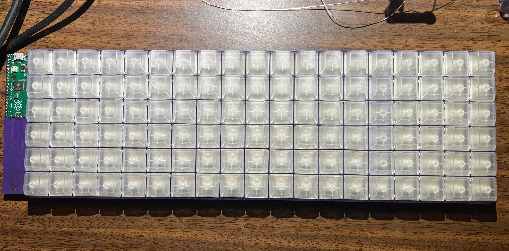
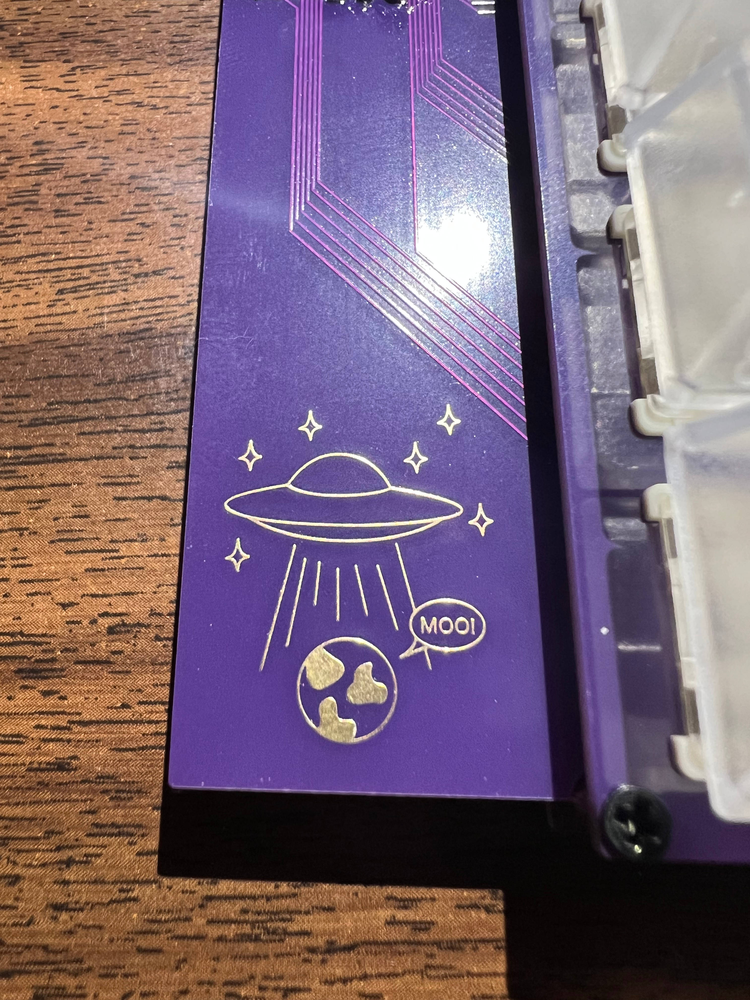

# UFO

This is the Unified Full-size Ortholinear keyboard, or UFO for short. It has 114 keys in 6 rows and 19 columns, per key RGB, and N-Key roll over. It is built around a Raspberry Pi Pico and has a doodle of a UFO abducting a spherical cow in a vacuum.

# BOM
1x Main PCB  
1x Bottom Case PCB  
1x Top Plate PCB  
1x Raspberry Pi Pico  
114x Kailh style hot swap sockets for MX style switches  
114x SK6812-MINI-E RGB LEDs  
114x 1N4148W or other similar SOD-123 diodes  
Solder, Solder Paste, Flux as needed  
8x M2 threaded 3mm diameter 8mm long standoffs  
8x M2 threaded 5mm long screws  

# Firmware
The firmware will be available as the UFO keyboard in QMK repository. It is also available in [my personal QMK repository](https://github.com/turnipjs/qmk_firmware).

# Images

